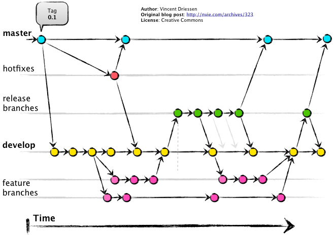
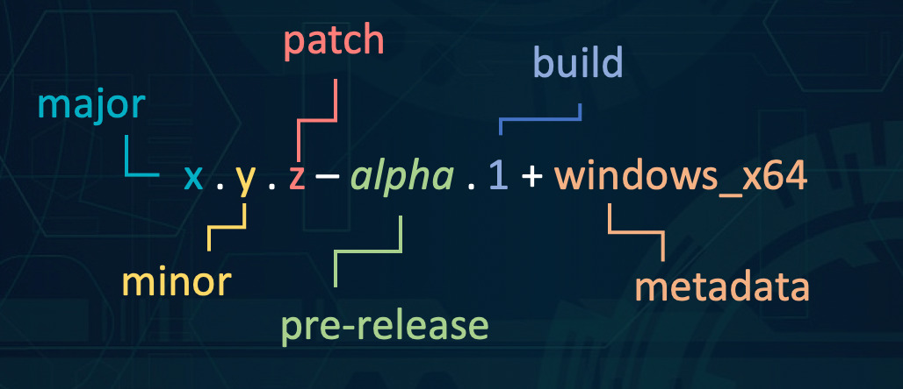
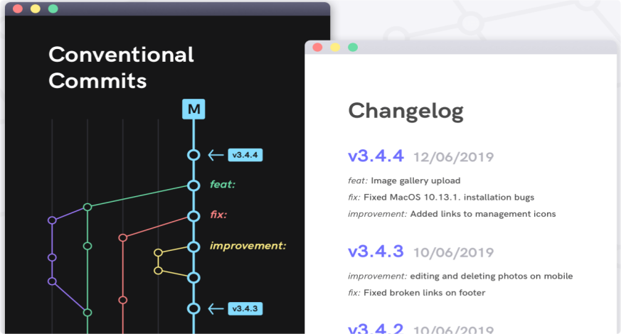

O desenvolvimento de software eficaz e colaborativo depende de práticas sólidas de controle de versão, gestão de código e garantia de qualidade através de testes adequados.<!--more--> Neste artigo, exploraremos as boas práticas do Git Flow, estratégias de versionamento de código, trabalho com ramificações(branches) e dicas para escrever testes de qualidade.


Apesar de parecer muito verboso para projetos pessoais, lembre-se que seu repositório pessoal geralmente é seu portifolio. Manter seus projetos com gitflow demonstra organização da entrega do seu código. 


## Git Flow: Gerenciando o Fluxo de Desenvolvimento
O Git Flow é um modelo de fluxo de trabalho popular que define uma estrutura robusta para o *desenvolvimento colaborativo* com o Git. Ele estabelece papéis e processos claros para diferentes estágios do ciclo de vida de um projeto. As principais ramificações ou branches incluem:



- **Master** ou **Main**: Esta é a *branch* principal que reflete o estado do projeto em produção. Commits nesta branch são estáveis e bem testados. Não é boa prática executar commits diretamente nesta branch, pois poderá quebrar o fluxo de trabalho de uma entrega ou até subir código não funcional em produção. Geralmente é usado como uma "fotografia" mais atualizada da ultima tag enviada para produção.
```bash
# exemplo
git branch main
``` 
- **tags**: Esta "branch" é usada para refletir o estado do projeto em produção, Possui uma forma diferente de ser invocada a partir do git, mas internamente é bem parecida a outras ramificações do projeto. No gitflow, pode ser gerado a partir da branch **release**. Por convenção, o nome de uma tag é estruturada conforme o padrão semântico do [semver.org](https://semver.org), no formato *v1.0.0*;  
```bash
# para criar
git tag v1.0.0

# para visualizar
git tag

# para enviar a tag para o servidor git
git push --tags
``` 
- **Release**: Esta é a branch usada para refletir uma cópia fiel do ambiente de produção do projeto. Nesta ramificação que geralmente são homologadas todas as novas funcionalidades antes de serem refletidas na branch **main**. Assim como a branch **main** e **develop**, não é boa prática realizar commits diretamente nesta ramificação. É a partir daqui, que depois do software homologado e preparado para produção, que é gerado a **tag** para a feature ir para a branch **main**. É usada para ser a fotografia da branch develop, porém pode receber mesclas(merge) no caso de correções de bugs emergênciais diretamente da branch **hotfix/nome-correcao-bug**. Geralmente quando ocorre uma correção emergencial, existe um fluxo de desenvolvimento para mesclar o **hotfix** na branch **develop** para que a correção seja incorporada em todos os estágios do fluxo de projeto. 

- **Develop**: Esta branch serve como uma base para o desenvolvimento contínuo. As novas funcionalidades e correções são mescladas nesta ramificação antes de serem testadas e consolidadas. Assim como a branch **main**, não é boa prática usar esta ramificação para desenvolvimento direto, pois, dependendo do tamanho da equipe que trabalha no projeto, pode acontecer de sobrescrever o trabalho de outra pessoa. Geralmente é nesta branch que as novas features são testadas antes de serem mescladas(merge) em **release**.

- **Feature Branches**: Para cada nova funcionalidade, uma ramificação separada é criada a partir de develop. Após a implementação, ela é mesclada de volta à develop. É muito importante o trabalho colaborativo entre as equipes que estão usando o gitflow atentar-se em sempre que uma nova feature for mergeada para develop, os demais colaboradores da equipe devem realizar a atualização de suas branches de features, evitando lacunas de commits. O comando usado para realizar isso é:

```bash
# cria uma branch
$ git branch feature/nova-funcionalidade-da-sprint
# força o update da branch develop do gitserver
$ git pull origin develop
# atualiza a minha branch atual baseado na branch developer
$ git rebase develop
```

- **Hotfix Branches**: Para correções urgentes em produção, cria-se uma ramificação de correção. Esta é mesclada tanto em release quanto em develop.

## Versionamento de código: Mantendo o Controle do seu projeto

O versionamento de código é crucial para a rastreabilidade e o gerenciamento de alterações. A Semantic Versioning (SemVer) é uma convenção popular para nomear versões de software:

- **Major**: Mudanças incompatíveis com versões anteriores.
- **Minor**: Adição de funcionalidades, mantendo compatibilidade.
- **Patch**: Correções de bugs, mantendo compatibilidade.

É boa prática adotar o [SemVer](https://semver.org/) na convenção de criação de tags facilita a compreensão do impacto das atualizações para outros desenvolvedores e usuários.

## Commits bem escritos: facilitando a leitura do seu trabalho

Para mensagens de commits, é importante seguir o [Conventional Commits](https://www.conventionalcommits.org/pt-br/v1.0.0/), que é uma convenção simples para utilizar nas mensagens de commit. De acordo com o site, *Ela define um conjunto de regras para criar um histórico de commit explícito, o que facilita a criação de ferramentas automatizadas baseadas na especificação.* Este formato de escrever auxilia na criação de documentações e controles de versão. É um aliado no desenvolvimento e se encaixa com o SemVer e o GitFlow, descrevendo os recursos, correções e modificações que quebram a compatibilidade nas mensagens de commit.

Sua estrutura é a seguinte: `<tipo>: <descrição>`, onde:

- **tipo**: pode ser `feat:`, `fix:`, `build:`, `chore:`, `ci:`, `docs:`, `style:`, `refactor:`, `perf:`, `test:`, `BREAKING CHANGE:`. Este prefixo é usado junto com o GitFlow para melhorar a leitura do histórico de commits.
- **descrição**: Descreve o que você fez.

 **Exemplo**: Se você estiver em sua branch feature/seu-trabalho-da-sprint usando boas práticas de criação de código limpo e TDD, seu trabalho pode ser organizado em três commits:

```bash
$ git commit -m "test: Criando os testes inciais do codigo"
# ...
$ git commit -m "feat: Criando o codigo baseado nos testes"
# ...
$ git commit -m "docs: Criando a documentação do meu codigo"
``` 


Nas boas práticas de escrita de código, o commit é a parte de sua contribuição que não deve impactar no funcionamento do que já existe implementado. Porém, é boa prática sempre salvar seus commits antes de sair do pc. Neste caso, pode usar o tipo *refactor:* e salvar seu trecho de trabalho. 


Recomendo a leitura no site [conventionalcommits.org](https://www.conventionalcommits.org/pt-br/v1.0.0/) e para testes em TDD, escrevi um artigo também, que pode ser acessado [aqui](/posts/test-driven-develo-nodejs-jest/).

