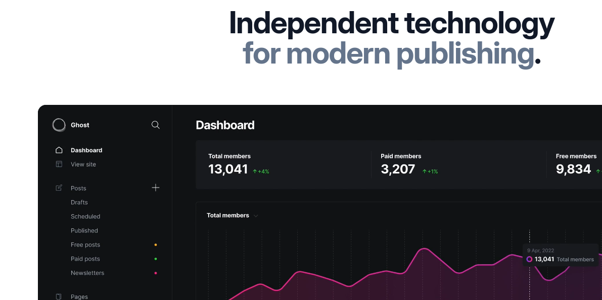
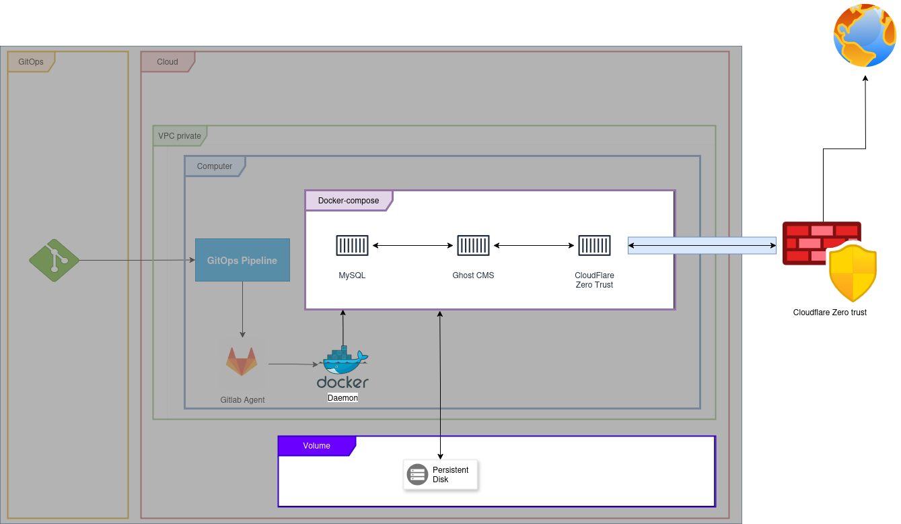
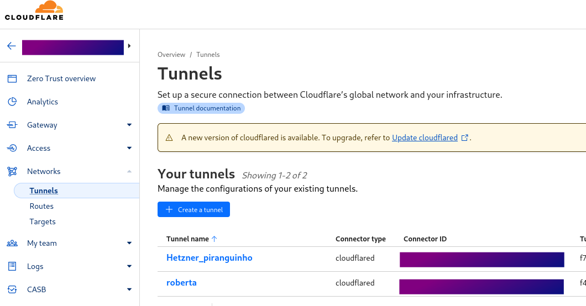
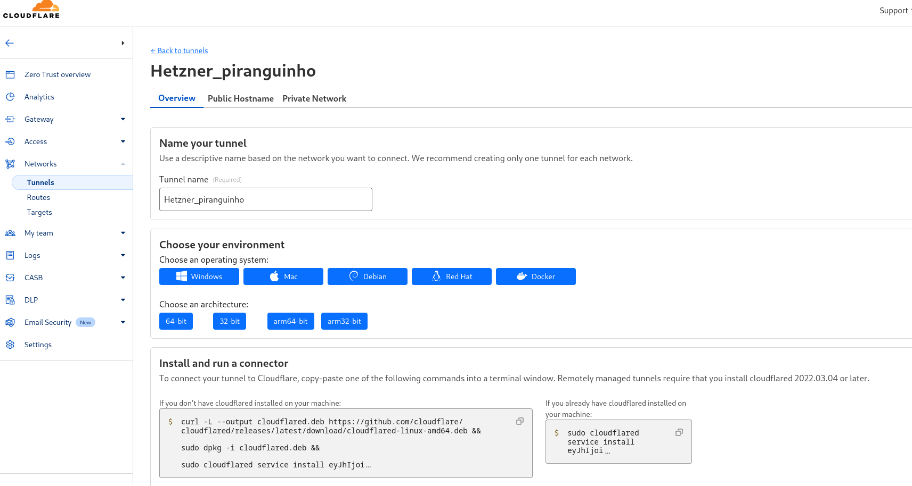
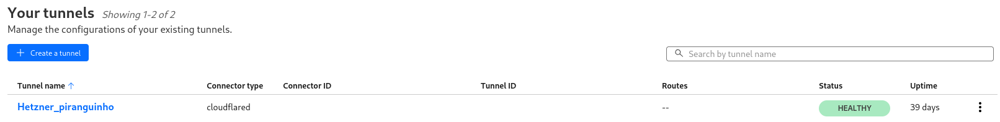
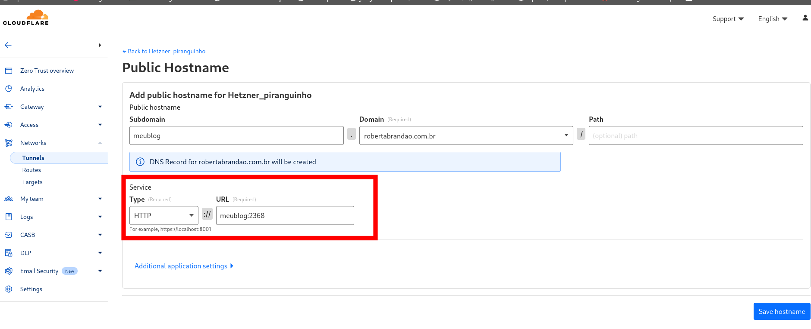

E este exemplo pode ajudar a colocar teu app na web.

Mas antes de tudo, gostaria de contar porquê eu mudei do gerador de sites estáticos Hugo, para um CMS (Content Management System).

Desde 2018, o gerador de sites com Jekyll e Hugo funcionavam bastante pra mim com GitHub Pages. O processo de publicação também me atendia bastante e o custo é praticamente zero se você não quiser ter um domínio .com ou .com.br, e rodava numa boa usando Git e uma Pipeline para atualizar a página estática e funcionava muito bem, pois não preciso gerenciar nenhuma infra-estrutura, só precisava garantir que o CI-CD do GitHub Actions estava funcionando numa boa. A forma de publicar um artigo também é bem fácil pra mim, usando o fluxo do git. [Boas razões para usar](https://github.com/betabrandao/betabrandao.github.io?ref=blog.robertabrandao.com.br).

Porém, chegou o momento que eu gostaria de mais features, queria ter uma newsletters e talvez poder ter um formato de blog para que outras pessoas não técnicas pudessem usar, precisava de um ambiente que eu pudesse escrever com mais flexibilidade, além de aumentar meu leque de integrações sem ter que reinventar a roda. 

Me incomodava também não conseguir usar algumas features do meu DNS da CloudFlare, no qual as configurações do Github Pages até o momento que escrevo, era impossível ativar o cacheamento e usar os serviços que gosto.

E nas buscas por CMS, escolhi o projeto [Ghost.org](https://ghost.org/?ref=blog.robertabrandao.com.br) que é Open Source e seu editor online lida bem com Markdown.

Ghost.org Dashboard

## Implantação

Se você não tem idéia do que é docker e docker-compose e necessita de um blog igual a este, [manda uma mensagem pra mim](https://blog.robertabrandao.com.br/about/), eu posso dar uma consultoria para isso.

### Requisitos

  * Uma máquina contectada na internet de forma initerrupta ou uma VPS (Virtual Private Server);
  * Um domínio .com ou .com.br;
  * Conhecimentos básicos em [Linux](https://blog.robertabrandao.com.br/aprendizagem-linux/), [docker](https://blog.robertabrandao.com.br/docker-na-pratica/), docker-compose e redes;
  * Uma conta no CloudFlare com um domínio configurado;

### Arquitetura

O projeto está dividido em duas partes: GitOps e Cloud (Hetzner). Neste artigo, vou focar no fluxo de funcionamento do Docker-Compose do ambiente Cloud. Com esta primeira configuração, é possível executar o blog em qualquer infra, independente se há ou não saída de internet com ip fixo, pois há o [Cloudflare Zero Trust](https://www.cloudflare.com/pt-br/learning/security/glossary/what-is-zero-trust/?ref=blog.robertabrandao.com.br) expondo a porta do serviço.

Arquitetura do Blog

## Docker Compose

Neste primeiro momento, vou focar no funcionamento do serviço Ghost com o banco de dados MySQL, não entrarei nos detalhes de otimizações de memória e CPU neste artigo, mas já está no roadmap falar sobre otimizações de recursos.
    
    
    services:
    
      tunnel:
        container_name: cloudflared-tunnel
        image: cloudflare/cloudflared
        restart: unless-stopped
        command: tunnel run
        environment:
          - TUNNEL_TOKEN=TOKENTUNELL_HERE
        networks:
          - ghost-network
    
      meublog:
        container_name: gost-cms
        image: ghost:5-alpine
        restart: always
        environment:
          # see https://ghost.org/docs/config/#configuration-options
          database__client: mysql
          database__connection__host: bancodedados
          database__connection__user: root
          database__connection__password: 'BEST_PASSWORD'
          database__connection__database: ghost_meublog
          url: 'https://blog.robertabrandao.com.br'
        volumes:
          - ./meublog:/var/lib/ghost/content
        networks:
          - ghost-network
    
      bancodedados:
        container_name: ghost-db
        image: mysql:8.0
        restart: always
        environment:
          MYSQL_ROOT_PASSWORD: 'BEST_PASSWORD'
        volumes:
          - ./database:/var/lib/mysql
        networks:
          - ghost-network
    
    networks:
      ghost-network:
    

docker-compose.yml

### Os Serviços

Neste primeiro momento temos 3 serviços ativos no `docker-compose.yml`: um servidor de banco de dados, o Ghost CMS e o Agent do Cloudflare, responsável pela exposição do serviço para a internet.

### Network

Na documentação do Ghost CMS, a porta do servidor web é a `2368`, caso queira testar localmente, é só expor a porta definindo no compose:
    
    
      meublog:
        container_name: gost-cms
        image: ghost:5-alpine
        restart: always
        ports:
          - 2368:2368
        environment:
          # see https://ghost.org/docs/config/#configuration-options
          database__client: mysql
          database__connection__host: bancodedados
          database__connection__user: root
          database__connection__password: 'BEST_PASSWORD'
          database__connection__database: ghost_meublog
          url: 'https://blog.robertabrandao.com.br'
        volumes:
          - ./meublog:/var/lib/ghost/content
        networks:
          - ghost-network

Note que, no docker-compose original não há nenhuma configuração de porta exposta nos serviços, isso quer dizer que só haverá comunicação entre os serviços dentro da rede `ghost-network`. O Compose, pelo Docker Daemon, define que, para estes processos containerizados, ele possuirá uma inteface virtual de rede e o Docker Daemon, resolve o [DNS de cada container](https://docs.docker.com/engine/network/?ref=blog.robertabrandao.com.br#dns-services), nomeando o domínio definido no `services`. Note também, que o serviço `meublog`, em sua environment `database__client: bancodedados` referencia o serviço de banco de dados `bancodedados`. Isso é importante para entender como o Agente do Cloudflare acessará os serviços por HTTP, já que não temos IPs fixo expostos na internet.

### Volumes

Por questões futuras de backup, decidi montar os volumes do container e dos dados do CMS para dois diretórios na raiz do projeto (do docker-compose.yml), o diretório `meublog` e o diretório `database`. Atualmente no meu servidor, o volume do docker está apontando para um disco externo com backup diário (snapshot) de 5 dias, que será trocado por uma rotina de backup em um Bucket S3 da Wasabi Cloud.

### CloudFlare Zero Trust

Basicamente, o serviço faz um tunnel de VPN entre a rede do docker-compose e o Cloudflare. 

O Dashboard para Criar um túnel e editar são os mesmos. O Agent do Cloudflare necessita do token que está em `base64` para incluir na variável `TUNNEL_TOKEN`. Este token está dentro da caixa de texto com o procedimento para instalar o agent, mas só pegaremos o token pra usar, vai ter que copiar para um editor de texto pra extrair o token, algo como o exemplo abaixo.

    
    
    sudo cloudflared service install eyJhIjoiMCIsInQiOiJmIiwicyI6IlRVIFBFTlNPVSBRVUUgSVJJQSBEQVIgRVNURSBNT0xFIERFIENPTE9DQVIgTUVVIFRPS0VOIEFRVUkgTUFORSBLS0sifSUK

O token acima é exemplo, use o seu.

Copie o token e insira no trecho do `docker-compose.yml`, como o exemplo abaixo:
    
    
    services:
    
      tunnel:
        container_name: cloudflared-tunnel
        image: cloudflare/cloudflared
        restart: unless-stopped
        command: tunnel run
        environment:
          - TUNNEL_TOKEN=eyJhIjoiMCIsInQiOiJmIiwicyI6IlRVIFBFTlNPVSBRV...
    
        networks:
          - ghost-network

Suba o serviço do docker-compose para verificar o status do agente do CloudFlare, o padrão é `Health`, na cor verde.

Agora, na aba Public Hostname dentro do seu Tunnel, insira o dominio que você vai usar, clicando em `+Add Public Hostname`. O Dash será como este: Veja que a config do nome da URL reflete a resolução de nomes onde o agente do Cloudflare está sendo executado. Neste caso, dentro do docker-compose. Clique depois em `Save Hostname`. Em alguns minutos você poderá acessar o blog externamente.

Com isso, terá teu blog exposto pelo CloudFlare.

### Dicas

  * Caso contrate algum serviço cloud, existe o Hetzner Cloud e Digital Ocean, com máquinas virtuais a baixo custo. Dê uma olhada também no Oracle Cloud, eles tem de 1 a 2 VMs no FreeTier.
  * Um Raspberry PI + no-break também dá certo.
  * Este setup pode te ajudar a resolver problemas de CORS no desenvolvimento local;
  * As pessoas também usam esta config para expor câmeras. 

