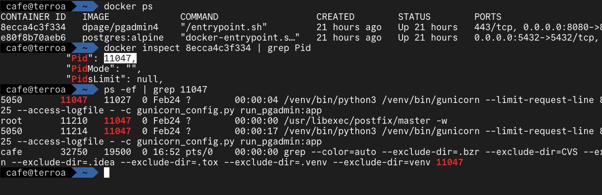

## Conceitos básicos de como começar com containers na prática

A virtualização de recursos é uma parte fundamental da moderna infraestrutura de TI. Nesse contexto, os containers têm desempenhado um papel crucial, oferecendo uma abordagem eficiente para empacotar e executar aplicativos com todas as suas dependências. Neste artigo, exploraremos os fundamentos de containers, Docker e LXC, revelando os conceitos por trás dessa tecnologia em constante evolução.

## Virtualização de máquina versus Contêinerização

Imagine que você está executando um servidor web para hospedar um site. Vamos explorar como isso seria feito usando máquinas virtuais e containers.

### Máquinas Virtuais:

  * **Configuração** : Você cria três máquinas virtuais usando um hipervisor (por exemplo, VMware, VirtualBox):
    * Uma para o servidor web (VM1).
    * Uma para o banco de dados (VM2).
    * Uma para o servidor de cache (VM3).
  * **Recursos** : Cada máquina virtual tem seu próprio sistema operacional completo, com sua própria alocação de CPU, memória e espaço em disco.
  * **Isolamento** : As máquinas virtuais são isoladas umas das outras, o que significa que um problema em uma VM não afetará as outras VMs.
  * **Desenvolvimento e Implantação** :
    * Você precisa configurar e gerenciar sistemas operacionais separados para cada máquina virtual.
    * O processo de criação, clonagem e gerenciamento de VMs pode ser demorado.

### Containers:

  * **Configuração** : Você cria três contêineres usando uma plataforma de containers (por exemplo, Docker):
    * Um para o servidor web (Container1).
    * Um para o banco de dados (Container2).
    * Um para o servidor de cache (Container3).
  * **Recursos** :
    * Todos os contêineres compartilham o mesmo kernel do sistema operacional hospedeiro, economizando recursos.
    * Cada contêiner é uma instância isolada de um sistema de arquivos e processos.
  * **Isolamento** :
    * Os contêineres são isolados, mas compartilham o mesmo kernel. Isso significa que há um risco menor de conflitos de recursos.
  * **Desenvolvimento e Implantação** :
    * Cada contêiner encapsula sua própria aplicação e dependências.
    * Os contêineres podem ser criados rapidamente a partir de imagens pré-construídas, agilizando o desenvolvimento e a implantação.
    * Os contêineres podem ser compartilhado através de um repositório.

Ambas as abordagens têm seus méritos, dependendo dos requisitos do projeto. Máquinas virtuais oferecem isolamento completo e flexibilidade para executar sistemas operacionais diferentes. No entanto, elas são mais pesadas em termos de recursos e mais demoradas para criar e gerenciar.

Os contêineres, por outro lado, oferecem isolamento eficiente e rápido, tornando-os ideais para desenvolvimento, implantação e dimensionamento. Eles compartilham recursos e são mais leves, mas podem ter menos isolamento do que máquinas virtuais.

Em última análise, a escolha entre máquinas virtuais e contêineres depende das necessidades do projeto, do equilíbrio entre isolamento e eficiência de recursos e da preferência pessoal.

## Containers: Uma Visão Geral

Imagem mostrando o processo do container na árvore do kernel

Os containers são ambientes isolados que contêm tudo o que um aplicativo precisa para ser executado - código, runtime, bibliotecas e variáveis de ambiente. Eles permitem que os desenvolvedores empacotem uma aplicação junto com todas as suas dependências em um único pacote consistente, independentemente do ambiente em que é executado.

😱

A ideia por trás dos contêineres não é nova. Os princípios de empacotamento de aplicativos e isolamento de recursos vêm sendo explorados há décadas. O uso de contêineres na computação remonta à década de 1970, quando os sistemas operacionais Unix introduziram o conceito de “chroot”, que permite criar um ambiente isolado para executar processos.

## Principais Benefícios

  * **Eficiência de Recursos:** Containers são mais leves que máquinas virtuais tradicionais, já que compartilham o mesmo kernel do sistema operacional e não precisam replicar todo um sistema operacional.
  * **Portabilidade:** Containers encapsulam tudo o que uma aplicação precisa. Isso torna os containers altamente portáteis, permitindo que uma aplicação seja executada consistentemente em diferentes ambientes.
  * **Velocidade:** Devido à sua leveza, os containers iniciam e param rapidamente, o que é especialmente benéfico para a implantação e escala de aplicações.
  * **Isolamento:** Os containers oferecem isolamento de recursos, permitindo que aplicações compartilhem um sistema, mas operem de forma independente e segura.

## LXC (Linux Containers): A Base do Docker

O Docker não é a única tecnologia de containers disponível. LXC, ou [Linux Containers](https://linuxcontainers.org/?ref=blog.robertabrandao.com.br), é a tecnologia subjacente que permitiu o desenvolvimento de plataformas como o Docker. O LXC fornece um ambiente de execução para múltiplos sistemas operacionais Linux isolados em uma única máquina física, expandindo o conceito do `chroot`. Já o Docker construiu sua abstração em torno do LXC, oferecendo uma experiência mais amigável e recursos adicionais.

### Conteito do Chroot (Change Root)

O chroot é um comando no Linux que permite alterar o diretório raiz de um processo e seus processos filhos para um diretório específico. Isso cria um ambiente isolado no qual um processo só consegue acessar arquivos e diretórios dentro desse novo diretório raiz, limitando assim seu acesso ao sistema de arquivos. Os Linux Containers (LXC) expandem o conceito de isolamento do chroot para criar ambientes de sistema operacional mais completos e isolados. Enquanto o chroot isola apenas um processo e seus descendentes, o LXC isola todo um sistema operacional, incluindo processos, sistema de arquivos, rede e variáveis de ambiente.

#### Funcionamento do Chroot

Suponhamos que você deseja criar um ambiente isolado para testar uma aplicação em uma distribuição Linux diferente daquela que você está usando. Com o chroot, você pode criar um ambiente isolado em um diretório. Por exemplo, digamos que você queira criar um outro ambiente dentro do Ubuntu:
    
    
    # instalando o debootstrap
    sudo apt-get install debootstrap
    
    # criando um diretorio que sera o container, isolando as dependencias em uma arvore de diretorio proria
    sudo mkdir /chroot-ubuntu
    
    # usando debootstrap para baixar uma imagem do linux para um diretorio que definimos
    sudo debootstrap --variant=minbase bionic /chroot-ubuntu http://archive.ubuntu.com/ubuntu/
    
    # Acessando a estrutura de diretorio do container isolado do restante do sistema
    sudo chroot /chroot-ubuntu

Acima, você está criando um ambiente do Ubuntu no diretório `/chroot-ubuntu` e, em seguida, usando o `chroot` para acessar a estrutura de diretorio do container que você criou.  
Neste exemplo acima, o processo compartilha todas as capacidades do Kernel hospedeiro, como acesso à redes e grupos privilegiados do sistema operacional.

## LXC (Linux Containers)

[Linux containers](https://linuxcontainers.org/lxc/introduction/?ref=blog.robertabrandao.com.br), ou LXC, antecessor da ferramenta Docker, é uma interface de uso para os recursos de contenção do kernel Linux. Os contêineres LXC são frequentemente considerados como algo no meio entre uma chroot e uma máquina virtual completa. O objetivo do LXC é criar um ambiente o mais próximo possível de uma instalação padrão do Linux, mas sem a necessidade de um kernel separado.

Através de uma API poderosa e ferramentas simples, ele permite que os usuários do Linux criem e gerenciem facilmente contêineres de sistema ou aplicativos com algumas características abaixo:

  * Espaços de nomes Kernel (ipc, uts, montagem, pid, rede e usuário)
  * Perfil de Aparação e SELinux
  * Políticas de Seccomp
  * Chroots (usando pivot_root)
  * Capacidades do kernel
  * CGrupos (grupos de controle)

No exemplo abaixo, temos o uso do LXC, você pode criar um ambiente isolado mais completo, incluindo sistema de arquivos, rede, etc:
    
    
    sudo apt-get install lxc
    

Em seguida, crie um contêiner LXC com um sistema operacional específico, como o Ubuntu. Veja que o LXC já está criando um container e executando internamente o `chroot`, `cgroups`, e baixando uma distribuição Ubuntu para o diretorio igual ao `debootstrap`. Este comando criará um contêiner LXC com o Ubuntu 18.04 (**Bionic** Beaver).
    
    
    sudo lxc-create -t download \ 
      -n meu-container -- --dist ubuntu \ 
      --release bionic --arch amd64

O próximo comando, vamos iniciar a árvore de processos do container através do comando `lxc-start`, que irá iniciar o terminal do container com Ubuntu 18.04
    
    
    # Iniciando o container para ser executado
    sudo lxc-start -n meu-container
    
    # Acessando o terminal do container
    sudo lxc-attach -n meu-container

Agora você está dentro do **contêiner LXC** , que oferece um ambiente isolado muito mais completo do que o chroot.

## Docker: Revolucionando a Implantação de Aplicativos

O Docker, assim como o LXC, é uma plataforma líder no mundo dos containers. Ele oferece uma maneira eficiente de criar, implantar e gerenciar containers. O Docker utiliza recursos do sistema operacional subjacente, mas isola completamente os processos em execução. Isso significa que você pode executar várias aplicações em diferentes containers, todos compartilhando o mesmo kernel do sistema operacional. Aqui está um exemplo básico de como criar um contêiner Docker a partir de uma imagem e executar um servidor web nele.

🐳

O nome ****Docker**** tem suas raízes na indústria de transporte e logística. Um ****docker**** é um termo que se refere a um trabalhador que carrega e descarrega cargas de contêineres em portos ou instalações de transporte. Esse termo foi adotado pela tecnologia de contêineres como uma analogia, refletindo o conceito de empacotar e transportar aplicativos juntamente com todas as suas dependências. A baleia da logo remete o navio com containers.

Para inicar o docker, certifique-se de tê-lo instalado em sua máquina. Você pode baixá-lo no site oficial do Docker: [https://www.docker.com/](https://www.docker.com/?ref=blog.robertabrandao.com.br)

#### Escolha uma Imagem

O Docker usa imagens para construir contêineres. Vamos usar uma imagem pré-construída do servidor web Apache para download e execução:
    
    
    # obtendo uma imagem pré-construida (build) do servidor http apache
    docker pull httpd:latest
    
    # listando a imagem que você baixou, ainda não iniciada
    docker image ls
    
    # Agora, crie um processo de execução de um contêiner usando a 
    # imagem que você baixou, que irá aparecer na arvore de 
    # processo do seu kernel
    docker run -d -p 8080:80 --name web httpd:latest

**Onde:**

  * **docker:** é a ferramenta
  * **run** : é o comando para executar o processo do container
  * -**d** : Executa o contêiner em segundo plano.
  * -**p** 8080:80: Mapeia a porta 8080 do host para a porta 80 do contêiner, pois a aplicação do httpd está programado para expor um webserver na porta 80 dentro do container, e estamos informando ao docker, que deve-se existir um redirecionamento da porta externa 8080 para a interna 80.
  * \--**name** web: Define o nome do contêiner como “web”, nome definido local
  * **httpd:latest** : O nome da imagem e sua tag, que foi definido por quem gerou a imagem.

💡

O LXC e Doker necessita que algum programa seja executado. No caso do exemplo do LXC, é inicado o Bash que abre o emulador de terminal. Já o exemplo do Docker, o processo é do servidor apache httpd. O conceito do container é que o processo seja efêmero, ou seja, o processo pode executar e morrer em seguida. O que estamos garantindo é que a aplicação será executada com isolamento de bibliotecas, só compartilhando o gerenciamento por parte do kernel. Importante saber sobre Linux para entender como funciona. 

Abra o navegador e acesse [http://127.0.0.1:8080](http://127.0.0.1:8080/?ref=blog.robertabrandao.com.br). Você verá a página padrão do servidor Apache.

## Docker Compose, Gerenciando Contêineres de forma organizada

O Docker Compose é uma ferramenta que permite definir e executar aplicativos multi-contêiner com um único arquivo de configuração com uma "receita de bolo" escrita, para execução de container com mais complexidade. Aqui está um exemplo de como usar o Docker Compose para criar uma aplicação web com um servidor web e um banco de dados. Deem uma lida na [identação do yaml](https://www.ibm.com/br-pt/topics/yaml?ref=blog.robertabrandao.com.br).

Crie um arquivo chamado docker-compose.yml:
    
    
    services:
      web:
        image: httpd:latest
        ports:
          - "8080:80"
      db:
        image: mongo:latest
        ports:
          - "27017:27017"
    

docker-compose.yml

Acima podemos avaliar que o docker compose já está inserindo um conceito de "**serviço** ", que temos uma árvore separada por identação e listas abaixo, mostrando a hierarquia de execução no exemplo abaixo:

  1. services: 
     1. web: 
        1. image: httpd:latest 
        2. ports: 
           1. \- "8080:80" 
     2. db: 
        1. image: mongo:latest 
        2. ports: 
           1. \- "27017:27017"

#### Executando os serviços do compose

No diretório onde você criou o arquivo docker-compose.yml, execute:
    
    
    docker compose up -d

**Onde** :

  * **docker** : é a ferramenta
  * **compose** : é referente que será executado uma lista de serviços definidos em um arquivo de configuração YAML pré definido
  * **up** : significa que os serviços serão baixados, criados e iniciados
  * -**d** : significa que será executado em segundo plano.

Para saber mais sobre Docker, tem um treinamento chamado [**Descomplicando Docker**](https://www.youtube.com/watch?v=Wm99C_f7Kxw&ref=blog.robertabrandao.com.br) da [Linuxtips](https://linuxtips.io/?ref=blog.robertabrandao.com.br) no Youtube, que é referência do mercado:

jefferson (Badtux) da LinuxTips com seu curso descomplicando docker
