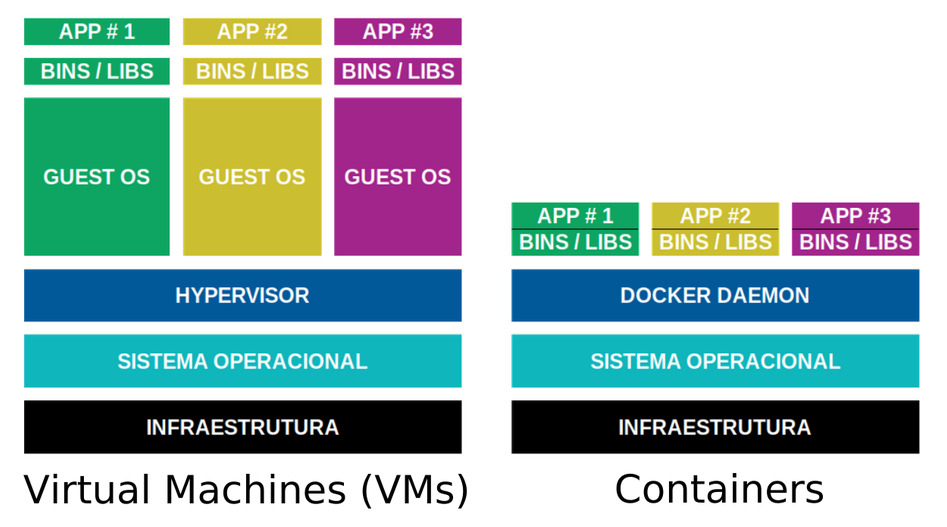
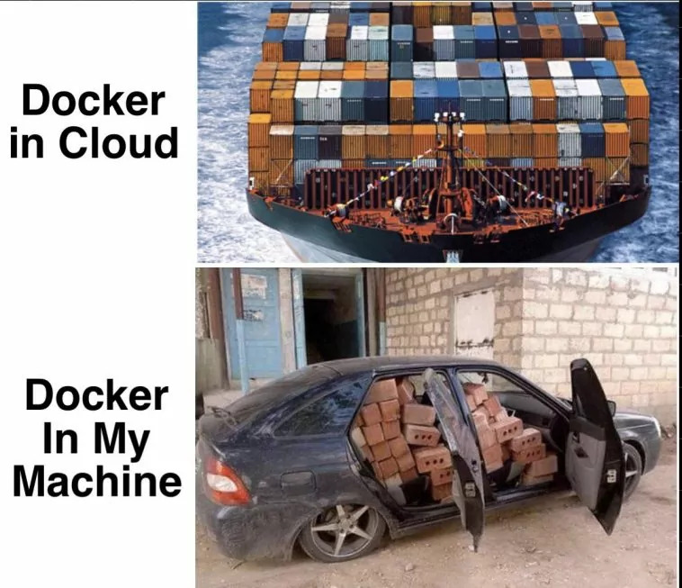

A virtualização de recursos é uma parte fundamental da moderna infraestrutura de TI. Nesse contexto, os containers têm desempenhado um papel crucial, oferecendo uma abordagem eficiente para empacotar e executar aplicativos com todas as suas dependências. Neste artigo, exploraremos os fundamentos de containers, Docker e LXC, revelando os conceitos por trás dessa tecnologia em constante evolução. <!--more-->

## Virtualização de máquina versus Contêinerização


Imagine que você está executando um servidor web para hospedar um site. Vamos explorar como isso seria feito usando máquinas virtuais e containers.

### Máquinas Virtuais:
- **Configuração**: Você cria três máquinas virtuais usando um hipervisor (por exemplo, VMware, VirtualBox):
	- Uma para o servidor web (VM1).
	- Uma para o banco de dados (VM2).
	- Uma para o servidor de cache (VM3).
- **Recursos**: Cada máquina virtual tem seu próprio sistema operacional completo, com sua própria alocação de CPU, memória e espaço em disco.
- **Isolamento**: As máquinas virtuais são isoladas umas das outras, o que significa que um problema em uma VM não afetará as outras VMs.
- **Desenvolvimento e Implantação**:
	- Você precisa configurar e gerenciar sistemas operacionais separados para cada máquina virtual.
	- O processo de criação, clonagem e gerenciamento de VMs pode ser demorado.

### Containers:
- **Configuração**: Você cria três contêineres usando uma plataforma de containers (por exemplo, Docker):
	- Um para o servidor web (Container1).
	- Um para o banco de dados (Container2).
	- Um para o servidor de cache (Container3).
- **Recursos**: 
	- Todos os contêineres compartilham o mesmo kernel do sistema operacional hospedeiro, economizando recursos. 
	- Cada contêiner é uma instância isolada de um sistema de arquivos e processos.
- **Isolamento**:
	- Os contêineres são isolados, mas compartilham o mesmo kernel. Isso significa que há um risco menor de conflitos de recursos.
- **Desenvolvimento e Implantação**:
	- Cada contêiner encapsula sua própria aplicação e dependências.
	- Os contêineres podem ser criados rapidamente a partir de imagens pré-construídas, agilizando o desenvolvimento e a implantação.
	- Os contêineres podem ser compartilhado através de um repositório.


Ambas as abordagens têm seus méritos, dependendo dos requisitos do projeto. Máquinas virtuais oferecem isolamento completo e flexibilidade para executar sistemas operacionais diferentes. No entanto, elas são mais pesadas em termos de recursos e mais demoradas para criar e gerenciar.

Os contêineres, por outro lado, oferecem isolamento eficiente e rápido, tornando-os ideais para desenvolvimento, implantação e dimensionamento. Eles compartilham recursos e são mais leves, mas podem ter menos isolamento do que máquinas virtuais.

Em última análise, a escolha entre máquinas virtuais e contêineres depende das necessidades do projeto, do equilíbrio entre isolamento e eficiência de recursos e da preferência pessoal.

## Containers: Uma Visão Geral

Os containers são ambientes isolados que contêm tudo o que um aplicativo precisa para ser executado - código, runtime, bibliotecas e variáveis de ambiente. Eles permitem que os desenvolvedores empacotem uma aplicação junto com todas as suas dependências em um único pacote consistente, independentemente do ambiente em que é executado.


A ideia por trás dos contêineres não é nova. Os princípios de empacotamento de aplicativos e isolamento de recursos vêm sendo explorados há décadas. O uso de contêineres na computação remonta à década de 1970, quando os sistemas operacionais Unix introduziram o conceito de "chroot", que permite criar um ambiente isolado para executar processos.


## Principais Benefícios
- **Eficiência de Recursos:** Containers são mais leves que máquinas virtuais tradicionais, já que compartilham o mesmo kernel do sistema operacional e não precisam replicar todo um sistema operacional.
- **Portabilidade:** Containers encapsulam tudo o que uma aplicação precisa. Isso torna os containers altamente portáteis, permitindo que uma aplicação seja executada consistentemente em diferentes ambientes.
- **Velocidade:** Devido à sua leveza, os containers iniciam e param rapidamente, o que é especialmente benéfico para a implantação e escala de aplicações.
- **Isolamento:** Os containers oferecem isolamento de recursos, permitindo que aplicações compartilhem um sistema, mas operem de forma independente e segura.

## LXC (Linux Containers): A Base do Docker
O Docker não é a única tecnologia de containers disponível. LXC, ou [Linux Containers](https://linuxcontainers.org/), é a tecnologia subjacente que permitiu o desenvolvimento de plataformas como o Docker. O LXC fornece um ambiente de execução para múltiplos sistemas operacionais Linux isolados em uma única máquina física, expandindo o conceito do `chroot`. Já o Docker construiu sua abstração em torno do LXC, oferecendo uma experiência mais amigável e recursos adicionais. 

### Conteito do Chroot (Change Root)
O chroot é um comando no Linux que permite alterar o diretório raiz de um processo e seus processos filhos para um diretório específico. Isso cria um ambiente isolado no qual um processo só consegue acessar arquivos e diretórios dentro desse novo diretório raiz, limitando assim seu acesso ao sistema de arquivos. Os Linux Containers (LXC) expandem o conceito de isolamento do chroot para criar ambientes de sistema operacional mais completos e isolados. Enquanto o chroot isola apenas um processo e seus descendentes, o LXC isola todo um sistema operacional, incluindo processos, sistema de arquivos, rede e variáveis de ambiente.

#### Funcionamento do Chroot
Suponhamos que você deseja criar um ambiente isolado para testar uma aplicação em uma distribuição Linux diferente daquela que você está usando. Com o chroot, você pode criar um ambiente isolado em um diretório. Por exemplo, digamos que você queira criar um outro ambiente dentro do Ubuntu:

```bash
sudo mkdir /chroot-ubuntu
sudo debootstrap --variant=minbase bionic /chroot-ubuntu http://archive.ubuntu.com/ubuntu/
sudo chroot /chroot-ubuntu
```
Aqui, você está criando um ambiente do Ubuntu no diretório `/chroot-ubuntu` e, em seguida, usando o `chroot` para acessá-lo.

No exemplo abaixo, temos o uso do LXC, você pode criar um ambiente isolado mais completo, incluindo sistema de arquivos, rede, etc.

#### Primeiro, instale o LXC e configure-o:

```bash
sudo apt-get install lxc
```
Em seguida, crie um contêiner LXC com um sistema operacional específico, como o Ubuntu:

```bash
sudo lxc-create -t download -n meu-container -- --dist ubuntu --release bionic --arch amd64
```
Isso criará um contêiner LXC com o Ubuntu 18.04 (Bionic Beaver).

#### Acesse o contêiner LXC:

```bash
sudo lxc-start -n meu-container
sudo lxc-attach -n meu-container
```
Agora você está dentro do **contêiner LXC**, que oferece um ambiente isolado muito mais completo do que o chroot.
---

## Docker: Revolucionando a Implantação de Aplicativos
O Docker é uma plataforma líder no mundo dos containers. Ele oferece uma maneira eficiente de criar, implantar e gerenciar containers. O Docker utiliza recursos do sistema operacional subjacente, mas isola completamente os processos em execução. Isso significa que você pode executar várias aplicações em diferentes containers, todos compartilhando o mesmo kernel do sistema operacional. Aqui está um exemplo básico de como criar um contêiner Docker a partir de uma imagem e executar um servidor web nele:


O nome **Docker** tem suas raízes na indústria de transporte e logística. Um **docker** é um termo que se refere a um trabalhador que carrega e descarrega cargas de contêineres em portos ou instalações de transporte. Esse termo foi adotado pela tecnologia de contêineres como uma analogia, refletindo o conceito de empacotar e transportar aplicativos juntamente com todas as suas dependências.


#### Instale o Docker
Certifique-se de ter o Docker instalado em sua máquina. Você pode baixá-lo no site oficial do Docker: https://www.docker.com/

#### Escolha uma Imagem
O Docker usa imagens para construir contêineres. Vamos usar uma imagem pré-construída do servidor web Apache.

```bash
docker pull httpd:latest
```

#### Crie e Execute um Contêiner
Agora, crie e execute um contêiner usando a imagem que você baixou:

```bash
docker run -d -p 8080:80 --name meu-container-apache httpd:latest
```

**Onde:** 

- -d: Executa o contêiner em segundo plano.
- -p 8080:80: Mapeia a porta 8080 do host para a porta 80 do contêiner.
- --name meu-container-apache: Define o nome do contêiner como "meu-container-apache".
- httpd:latest: O nome da imagem e sua tag.

#### Acesse o Servidor Web
Abra o navegador e acesse http://localhost:8080. Você verá a página padrão do servidor Apache.


## Docker Compose,  Gerenciando Contêineres de forma fácil
O Docker Compose é uma ferramenta que permite definir e executar aplicativos multi-contêiner com um único arquivo de configuração. Aqui está um exemplo de como usar o Docker Compose para criar uma aplicação web com um servidor web e um banco de dados.

### Instale o Docker Compose
Certifique-se de ter o Docker Compose instalado. Ele é geralmente instalado automaticamente junto com o Docker, mas você pode verificar sua versão com:

```bash
docker compose --version
```

### Crie um Arquivo de Configuração do Compose
Crie um arquivo chamado docker-compose.yml e adicione o seguinte conteúdo:

```yaml
version: '3'
services:
  web:
    image: httpd:latest
    ports:
      - "8080:80"
  db:
    image: mongo:latest
    ports:
      - "27017:27017"
```

### Inicie a Aplicação
No diretório onde você criou o arquivo docker-compose.yml, execute:

```bash
docker compose up -d
```

Isso criará e iniciará os contêineres definidos no arquivo de configuração.

### Acesse o Servidor Web
Abra o navegador e acesse http://localhost:8080. O servidor apache deverá estar em execução.

---

## Meu app rodando em Docker com Docker Compose



Neste exemplo, criaremos dois contêineres: um para o servidor Node.js e outro para o banco de dados MongoDB.

### Estrutura do Projeto
Crie uma estrutura de diretórios para o projeto:

```text
my-nodejs-app/
│── docker-compose.yml
│── Dockerfile
│── app/
│     ├── package.json
│     ├── server.js
```

### Crie o Arquivo do Dockerfile
Crie um arquivo `Dockerfile` na pasta raiz do projeto e adicione o seguinte conteúdo:

```Dockerfile
FROM node:10-alpine
RUN mkdir -p /home/node/app/node_modules && chown -R node:node /home/node/app
WORKDIR /home/node/app
COPY package*.json ./
USER node
RUN npm install
COPY --chown=node:node . .
EXPOSE 8080
CMD [ "node", "server.js" ]
```

### Crie o Arquivo do Docker Compose
Crie um arquivo `docker-compose.yml` na pasta raiz do projeto e adicione o seguinte conteúdo:

```yaml
version: '3'
services:
  nodejs:
    build:
      context: .
      dockerfile: Dockerfile
    image: nodejs
    container_name: nodejs
    ports:
      - "3000:3000"
    volumes:
      - ./app:/home/node/app
      - ./node_modules:/home/node/app/node_modules
    depends_on:
      - db
  db:
    image: mongo:latest
    ports:
      - "27017:27017"
    volumes:
      - mongodb-data:/data/db
volumes:
  mongodb-data:
```

### Crie a Aplicação Node.js
Dentro da pasta app, crie um arquivo package.json com o seguinte conteúdo:

```json
{
  "name": "nodejs-docker-compose-example",
  "version": "1.0.0",
  "description": "Example Node.js app with Docker Compose",
  "dependencies": {
    "express": "^4.17.1",
    "mongodb": "^3.6.6"
  }
}
```
Em seguida, crie um arquivo server.js na mesma pasta com o seguinte conteúdo:

```javascript
const express = require('express');
const MongoClient = require('mongodb').MongoClient;

const app = express();
const port = 3000;

const url = 'mongodb://db:27017';
const dbName = 'mydb';

app.get('/', (req, res) => {
  MongoClient.connect(url, { useUnifiedTopology: true }, (err, client) => {
    if (err) {
      res.send('Error connecting to the database');
      return;
    }

    const db = client.db(dbName);
    const collection = db.collection('messages');

    collection.insertOne({ message: 'Hello from Docker!' }, (err, result) => {
      if (err) {
        res.send('Error inserting data into database');
      } else {
        res.send('Data inserted successfully');
      }

      client.close();
    });
  });
});

app.listen(port, () => {
  console.log(`Server is running on port ${port}`);
});
```

### Inicie os Contêineres
Navegue até o diretório raiz do projeto e execute o seguinte comando:

```bash
docker compose up -d
```

Isso criará e iniciará os contêineres definidos no arquivo `docker-compose.yml`.

### Acesse a API
Abra um navegador ou use uma ferramenta como o curl para acessar a API: http://localhost:3000

A resposta deverá ser "Data inserted successfully". Isso significa que a API Node.js inseriu com sucesso um documento no banco de dados MongoDB.

Pronto! Você criou um aplicativo Node.js com uma API usando o Docker Compose. Agora, você pode escalar, gerenciar e implantar facilmente esse aplicativo com todos os seus componentes interconectados.


## Conclusão

Não existe desculpa para não aprender!!! Para saber mais sobre Docker, tem um treinamento chamado [**Descomplicando Docker**](https://www.youtube.com/watch?v=Wm99C_f7Kxw) da [Linuxtips](https://linuxtips.io/) no Youtube, que é referência do mercado: 



---
<3

