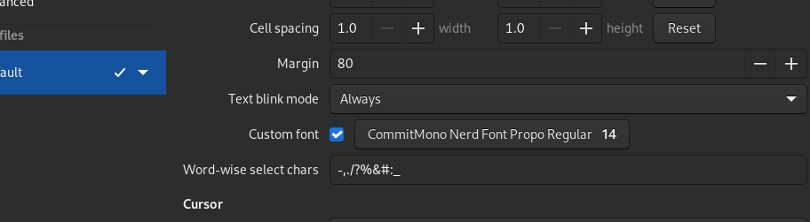
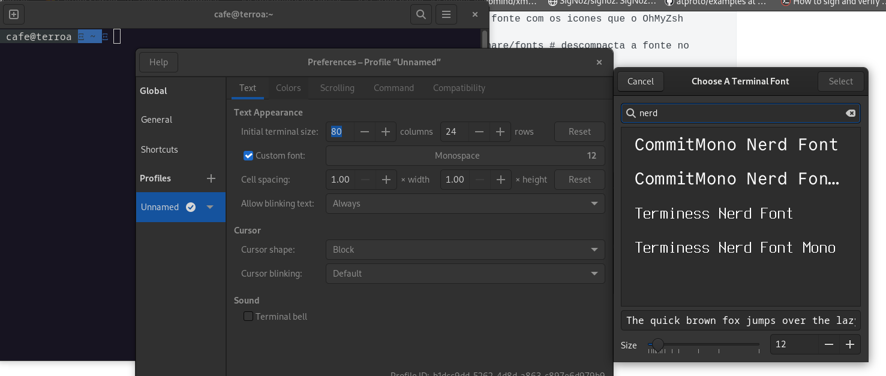

Seguimos com um procedimento sobre a base do linux, com explicações diretas sobre comandos essenciais na administração do Linux. Para uma introdução mais histórica, sugiro acessar os links do **tópico 1** do artigo de [Curadoria de Aprendizagem Linux](https://blog.robertabrandao.com.br/aprendizagem-linux/)

No Linux, tudo é representado como um arquivo ou diretório. A estrutura segue o padrão Filesystem Hierarchy Standard (FHS):

### Diretórios Principais:

Diretório | Descrição  
---|---  
`/` | Raiz do sistema de arquivos, tudo começa aqui.  
`/bin` | Binários essenciais (comandos básicos, ex: `ls`, `cp`).  
`/sbin` | Binários administrativos (ex: `fdisk`, `shutdown`).  
`/home` | Diretórios dos usuários (`/home/usuario`).  
`/root` | Diretório do superusuário `root`.  
`/etc` | Arquivos de configuração do sistema.  
`/var` | Dados variáveis (logs, filas de impressão, cache).  
`/tmp` | Arquivos temporários (limpos após reinicialização).  
`/usr` | Aplicações e bibliotecas não essenciais.  
`/opt` | Aplicações opcionais instaladas manualmente.  
`/dev` | Arquivos de dispositivos (ex: `/dev/sda` para discos).  
`/proc` | Informações do sistema e processos em tempo real.  
`/sys` | Informações sobre hardware e kernel.  
`/mnt` e `/media` | Pontos de montagem para dispositivos externos.  
  
* * *

## Comandos Básicos do Linux

### 1\. Navegação no Sistema de Arquivos
    
    
    pwd        # Mostra o diretório atual
    ls         # Lista arquivos e diretórios
    ls -l      # Lista detalhada
    ls -a      # Inclui arquivos ocultos
    cd /etc    # Acessa o diretório /etc
    cd ~       # Volta para o diretório do usuário
    cd ..      # Volta um nível
    cd -       # Alterna para o diretório anterior
    

### 2\. Manipulação de Arquivos e Diretórios
    
    
    mkdir novo_dir    # Cria um diretório
    rmdir vazio       # Remove um diretório vazio
    rm arquivo.txt    # Remove um arquivo
    rm -rf pasta/     # Remove uma pasta e seu conteúdo
    cp origem destino # Copia um arquivo ou diretório
    mv origem destino # Move ou renomeia arquivos/diretórios
    touch novo.txt    # Cria um arquivo vazio
    

### 3\. Exibição e Busca de Arquivos
    
    
    cat arquivo.txt   # Exibe o conteúdo do arquivo
    less arquivo.txt  # Permite rolar pelo arquivo
    head arquivo.txt  # Mostra as primeiras 10 linhas
    tail arquivo.txt  # Mostra as últimas 10 linhas
    find /home -name "*.txt"  # Busca arquivos por nome
    grep "erro" log.txt       # Procura a palavra "erro" em um arquivo
    

### 4\. Permissões e Propriedades de Arquivos
    
    
    ls -l arquivo.txt  # Exibe permissões do arquivo
    chmod 755 script.sh  # Modifica permissões (rwxr-xr-x)
    chown user:grupo arquivo.txt  # Muda dono do arquivo
    

### 5\. Processos e Sistema
    
    
    ps aux      # Lista processos em execução
    top         # Exibe processos ativos em tempo real
    kill PID    # Mata um processo pelo ID
    df -h       # Mostra espaço em disco
    du -sh pasta/  # Mostra tamanho de uma pasta
    uptime      # Mostra tempo ligado do sistema
    

### 6\. Gerenciamento de Pacotes

**Arch Linux (Pacman)**
    
    
    sudo pacman -Syu       # Atualiza sistema
    sudo pacman -S neofetch  # Instala o neofetch
    

**CentOS/RHEL (YUM/DNF)**
    
    
    sudo yum update         # Atualiza pacotes
    sudo yum install nano   # Instala o editor nano
    

**Debian/Ubuntu (APT)**
    
    
    sudo apt update         # Atualiza lista de pacotes
    sudo apt upgrade        # Atualiza pacotes instalados
    sudo apt install htop   # Instala o pacote "htop"
    

* * *

## **Trabalhando com Permissões de Arquivos e Diretórios**

### 1.**Entendendo as Permissões no Linux**

Cada arquivo e diretório tem permissões definidas para três tipos de usuários:

Tipo | Descrição  
---|---  
**Usuário (u)** | Dono do arquivo  
**Grupo (g)** | Usuários do mesmo grupo do arquivo  
**Outros (o)** | Todos os outros usuários  
  
Cada arquivo/diretório tem três tipos de permissões:

  * **r (read)** → Permissão de leitura (`4`)
  * **w (write)** → Permissão de escrita (`2`)
  * **x (execute)** → Permissão de execução (`1`)

As permissões são visualizadas com `ls -l`:
    
    
    ls -l arquivo.txt
    # Saída:
    # -rw-r--r-- 1 usuario grupo 1234 Mar 9 12:00 arquivo.txt
    

**Explicação do resultado:**

  * `-` → Tipo (`-` = arquivo, `d` = diretório)
  * `rw-` → Dono tem **leitura e escrita** (4+2=6)
  * `r--` → Grupo tem **apenas leitura** (4)
  * `r--` → Outros têm **apenas leitura** (4)

* * *

### 2\. **Modificando Permissões**

#### **Usando chmod (modo numérico)**
    
    
    chmod 755 script.sh  # Dono: rwx (7), Grupo: r-x (5), Outros: r-x (5)
    chmod 644 documento.txt  # Dono: rw-, Grupo: r--, Outros: r--
    

#### **Usando chmod (modo simbólico)**
    
    
    chmod u+x script.sh  # Adiciona execução para o dono
    chmod g-w documento.txt  # Remove escrita para o grupo
    chmod o+r arquivo.log  # Adiciona leitura para outros
    

* * *

### 3\. **Alterando o Dono e o Grupo**
    
    
    chown usuario arquivo.txt  # Muda o dono do arquivo
    chown usuario:grupo arquivo.txt  # Muda dono e grupo
    chgrp grupo arquivo.txt  # Muda apenas o grupo
    

* * *

### 4\. **Permissões Especiais**

**Sticky Bit** → Apenas o dono pode deletar.
    
    
    chmod +t /tmp  # Aplicado em /tmp por padrão
    

**SGID (Set Group ID)** → Arquivos herdados pelo grupo.
    
    
    chmod g+s pasta/
    

**SUID (Set User ID)** → Executa o programa com permissões do dono.
    
    
    chmod u+s arquivo  # Exemplo: /usr/bin/passwd
    

* * *

## **Utilização do Terminal: Bash vs Zsh**

### 1\. **O que são Bash e Zsh?**

  * **Bash (Bourne Again Shell)** → Shell padrão da maioria das distros Linux.
  * **Zsh (Z Shell)** → Uma alternativa mais avançada, com mais recursos.

* * *

### 2\. **Principais Diferenças entre Bash e Zsh**

Funcionalidade | Bash | Zsh  
---|---|---  
**Autocompletar** | Simples | Melhorado, sugere opções  
**Correção automática** | ❌ | ✅ Corrige typos (`cd /hmme` → `/home`)  
**Expansão de`**`** | Apenas arquivos | Expande diretórios inteiros  
**Histórico compartilhado** | ❌ | ✅ Histórico entre terminais  
**Globbing Avançado** | ❌ | ✅ `ls **/*.txt` encontra todos os `.txt`  
**Plugins e Temas** | ❌ | ✅ `oh-my-zsh` adiciona extensões e temas  
**/dev/tcp** | ✅ `bash` tem link simbólico para operações de rede | ❌  
  
* * *

### 3\. **Usando Bash e Zsh**

🔹 **Testar qual shell está em uso:**
    
    
    echo $SHELL
    # /bin/bash ou /bin/zsh
    

🔹 **Trocar temporariamente de shell:**
    
    
    bash  # Entra no Bash
    zsh   # Entra no Zsh
    

🔹 **Definir um shell padrão:**
    
    
    chsh -s $(which zsh)  # Define Zsh como shell padrão
    

* * *

## **Melhorando o Zsh com Oh My Zsh**

Oh My Zsh é um framework que adiciona plugins e temas ao Zsh, é o que uso no meu dia-a-dia.

### **1\. Instalar ícones da Nerdfont**
    
    
    mkdir -p ~/.local/share/fonts # cria o diretorio caso não exista
    wget https://github.com/ryanoasis/nerd-fonts/releases/download/v3.3.0/Terminus.zip # faz o download da fonte com os icones que o OhMyZsh necessita
    unzip Terminus.zip -d ~/.local/share/fonts # descompacta a fonte no diretorio
    fc-cache # atualiza a lista de fontes
    fc-list | grep Termi # visualiza a fonte instalada

Lembre-se de selecionar a fonte que instalou na config do seu terminal no seu linux. Meu terminal, é o Tilix e você pode encontrar algo assim:

Config do Tillx, tive que habilitar Custom FontConfig do Gnome terminal

### 2\. **Instalar Oh My Zsh**
    
    
    sh -c "$(curl -fsSL https://raw.githubusercontent.com/ohmyzsh/ohmyzsh/master/tools/install.sh)"
    

### 3\. **Escolher um Tema (Ex: Powerlevel10k)**
    
    
    git clone --depth=1 https://github.com/romkatv/powerlevel10k.git ${ZSH_CUSTOM:-$HOME/.oh-my-zsh/custom}/themes/powerlevel10k
    echo 'ZSH_THEME="powerlevel10k/powerlevel10k"' >> ~/.zshrc
    source ~/.zshrc
    

* * *

## Dicas Extras:

  * Use `man comando` para ler a documentação de qualquer comando.
  * Use `tab` para autocompletar diretórios/comandos.
  * Use `ctrl + c` para interromper processos em execução.
  * Use `ctrl + r` para pesquisar comandos anteriores no terminal.
  * Dê uma olhada nos projeto [OhMyBash](https://github.com/ohmybash/oh-my-bash?ref=blog.robertabrandao.com.br) e o [OhMyZsh](https://ohmyz.sh/?ref=blog.robertabrandao.com.br) para personalizar seu terminal.
  * Procure aprender VIM, pois uma hora, numa manutenção, será o único editor disponível em sistemas linux.
  * NeoVim + [NVCHAD](https://nvchad.com/?ref=blog.robertabrandao.com.br) é um caminho para uma IDE sem mouse.

