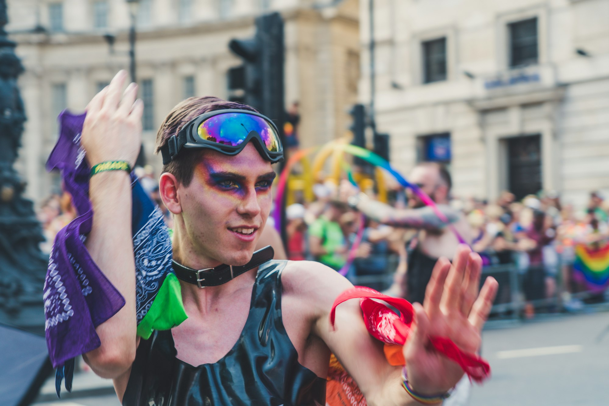
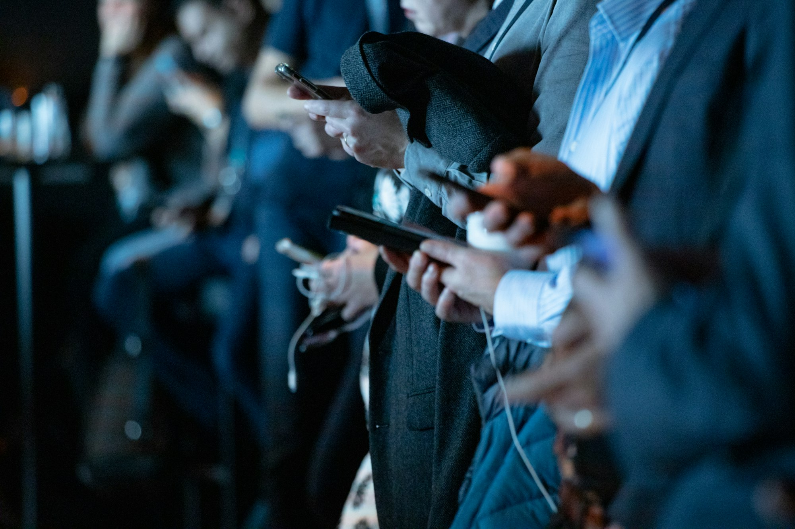
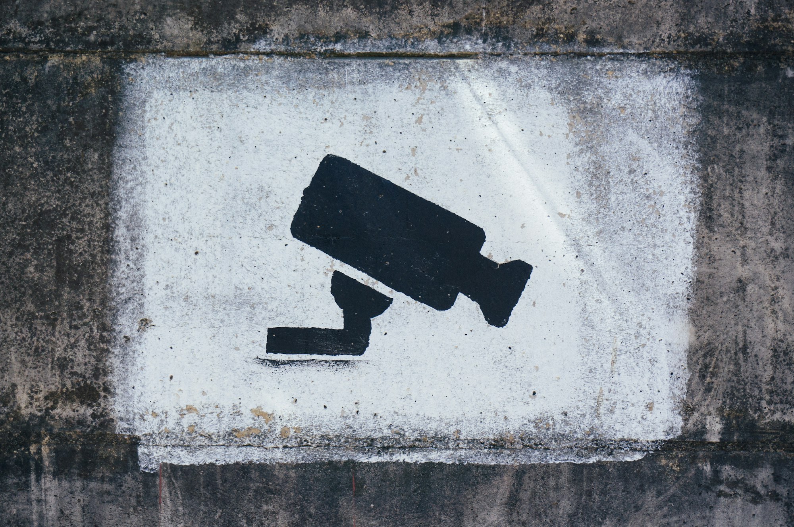

Uma breve explanação de como um um Pacto de 1969, assinado pelo Brasil pode ajudar a minimizar as lacunas em relação à proteção contra crimes de ódio, auxiliando o Marco Civil da Internet Brasileira.  
  
Para saber, o [**Pacto de San José da Costa Rica**](https://www.oas.org/dil/esp/1969_Convenci%C3%B3n_Americana_sobre_Derechos_Humanos.pdf?ref=blog.robertabrandao.com.br) (Convenção Americana sobre Direitos Humanos), assinado em 1969 e em vigor desde 1978, é um tratado internacional de direitos humanos do qual o Brasil é signatário. Ele garante direitos fundamentais, como liberdade de expressão, proteção contra discriminação e **direito à privacidade**.

Photo by [Paolo Nicolello](https://unsplash.com/@paul_nic?ref=blog.robertabrandao.com.br) / [Unsplash](https://unsplash.com/?utm_source=ghost&utm_medium=referral&utm_campaign=api-credit)

O Marco Civil da Internet (Lei nº 12.965/2014) foi um grande avanço na regulação no país, garantindo princípios como a neutralidade da rede, privacidade e liberdade de expressão. No entanto, há algumas lacunas que podem impactar minorias e levar à criminalização injusta na proliferação das chamadas fakeNews.

Este estudo iniciou-se quando tive contato com um [artigo](https://bibliotecadigital.tse.jus.br/xmlui/bitstream/handle/bdtse/11950/2022_souza_mensagens_odio_recebidas.pdf?sequence=8&isAllowed=y&ref=blog.robertabrandao.com.br) de [Ladyane Souza ](https://www.linkedin.com/in/ladyane-souza?miniProfileUrn=urn%3Ali%3Afs_miniProfile%3AACoAABxQJl8BUsmMVsJ9DzZwNwtEXxyRJ3BTo6I&lipi=urn%3Ali%3Apage%3Ad_flagship3_search_srp_all%3BIQcewe%2BaTuyu%2FVtI2yiUZg%3D%3D&ref=blog.robertabrandao.com.br)sobre mensagens de ódio nas eleições de 2022 à mulheres pretas e brancas, com um estudo aprofundado sobre violência política de gênero e de como o estudo aprofunda nas capacidades para explanar estatisticamente o perfil de ataque.

Em uma pesquisa sobre o Marco Civil da Internet em sua dissonância sobre ataques proferidos à minorias, explano tópicos sobre potências para serem exploradas como pontos de rupturas que enfraquecem o Marco Civil da Internet.

  1. **Falta de Proteção Contra Discurso de Ódio e Assédio**
     * O Marco Civil protege a liberdade de expressão, mas não possui dispositivos claros contra discurso de ódio direcionado a minorias. A retirada de conteúdo ofensivo depende da judicialização, o que pode ser demorado e ineficaz. O **Artigo 1º** do pacto determina que os Estados signatários devem respeitar e garantir os direitos humanos sem discriminação. Isso pode ser invocado para cobrar ações mais rápidas contra discursos de ódio na internet, mesmo quando o Marco Civil não prevê medidas específicas.
     * Redes sociais frequentemente falham na moderação de conteúdo, permitindo perseguições e ameaças contra grupos vulneráveis. O **Artigo 13** do pacto protege a liberdade de expressão, mas **proíbe propaganda a favor da guerra e apologia ao ódio racial ou religioso**. Isso pode ser um argumento para exigir uma regulação mais firme contra fake news e ataques a minorias.

Photo by [camilo jimenez](https://unsplash.com/@camstejim?ref=blog.robertabrandao.com.br) / [Unsplash](https://unsplash.com/?utm_source=ghost&utm_medium=referral&utm_campaign=api-credit)

  1. **Responsabilidade das Plataformas e Remoção de Conteúdo**
     * O **artigo 19** do Marco determina que plataformas só podem ser responsabilizadas por conteúdos de terceiros mediante decisão judicial. Isso pode atrasar a remoção de fake news, discursos de ódio e perseguições a minorias. **Artigo 16** **do Pacto** protege o **direito de associação** , garantindo que coletivos de minorias possam se organizar online sem perseguição. Se autoridades usarem o Marco Civil para censurar ou criminalizar movimentos sociais, esse artigo pode ser uma defesa legal.
     * A ausência de mecanismos rápidos para remoção de conteúdos discriminatórios pode levar a danos irreversíveis à minorias, porém, o **artigo 25 do Pacto** estabelece o direito à proteção judicial efetiva. Isso pode ser utilizado para argumentar que processos contra ativistas baseados em lacunas do **Marco Civil** violam garantias internacionais. 
  2. **Anonimato e Uso Indevido de Dados para Perseguir Minorias**
     * Embora o anonimato seja proibido (art. 5º, IV da Constituição), a identificação de usuários pode ser usada de forma arbitrária contra ativistas e membros de grupos marginalizados. O **Artigo 11 do Pacto** , além de garantir privacidade, pode ser usado para questionar a vigilância excessiva de minorias e ativistas, especialmente no contexto da exigência de armazenamento de dados prevista no **Marco Civil**.
     * Sem uma regulação forte sobre coleta e uso de dados, governos e empresas podem abusar dessas informações para vigilância seletiva, como por exemplo [o caso da Meta](https://theintercept.com/2024/05/22/whatsapp-security-vulnerability-meta-israel-palestine/?ref=blog.robertabrandao.com.br), na venda de matadados para o massacre à Gaza. O **Artigo 8º do Pacto** garante o **direito ao devido processo legal** , o que pode ser usado para contestar investigações abusivas baseadas em coleta de metadados online.
  3. **Desinformação e Fake News Direcionadas**
     * O Marco Civil não prevê mecanismos eficazes para combater campanhas de desinformação que atacam minorias e movimentos sociais.
     * Políticos e grupos extremistas utilizam lacunas na regulação para espalhar conteúdo falso e incitar violência, sem responsabilização direta.
  4. **Falta de Proteção para Comunidades LGBTQIA+ e Grupos Vulneráveis**
     * Não há mecanismos específicos no **Marco Civil** para combater práticas discriminatórias, como censura seletiva ou silenciamento de pautas progressistas por algoritmos de redes sociais, mas os princípios do **Artigo 24 do Pacto (Igualdade perante a lei)** podem ser usados para questionar práticas discriminatórias de algoritmos que censuram conteúdos progressistas ou promovem desinformação contra minorias, como por exemplo em alguns casos abaixo:
       * Estudos e denúncias indicam que plataformas como YouTube e Instagram frequentemente [marcam conteúdos de criadores LGBTQIA](https://irisbh.com.br/conteudo-perigoso-a-invisibilizacao-da-comunidade-lgbtqia-na-moderacao-de-conteudo/?ref=blog.robertabrandao.com.br)\+ como "sensíveis" ou "inadequados", mesmo sem violar diretrizes.
       * Em 2021, [criadores trans processaram o YouTube por supressão sistemática de vídeos](https://www.businessinsider.com/youtubers-identify-title-words-that-get-videos-demonetized-experiment-2019-10?ref=blog.robertabrandao.com.br). Esse tipo de prática pode ser contestada com base no **Artigo 24 do Pacto** , argumentando que o algoritmo viola a igualdade de proteção legal ao aplicar filtros discriminatórios.
       * Movimentos sociais frequentemente enfrentam perseguições baseadas na interpretação vaga da "**ordem pública** " ou "**manutenção da moralidade** ". O Artigo 13 do pacto garante o direito à liberdade de pensamento e expressão, proibindo censura prévia, exceto em casos específicos, como a proteção de crianças. Isso significa que a criminalização de discursos de movimentos sociais sob o pretexto de "ordem pública" pode ser contestada, pois viola o **direito à livre manifestação**. Esse artigo pode ser usado para questionar remoções arbitrárias de conteúdos na internet ou o silenciamento de ativistas em redes sociais.
  5. **Interferência do Estado e Monitoramento Excessivo**
     * **O artigo 10 do Marco** exige guarda e fornecimento de dados mediante ordem judicial, mas há casos de abuso por autoridades, especialmente contra ativistas e jornalistas. Falta um controle mais rigoroso sobre como essas informações podem ser usadas para criar perseguições políticas e sociais.

Photo by [Tobias Tullius](https://unsplash.com/@tobiastu?ref=blog.robertabrandao.com.br) / [Unsplash](https://unsplash.com/?utm_source=ghost&utm_medium=referral&utm_campaign=api-credit)

  1. **Deficiências na Regulação de Inteligência Artificial e Algoritmos**
     * O Marco Civil não prevê normas específicas sobre viés algorítmico, que pode resultar em discriminação automatizada de minorias em plataformas digitais e algoritmos de redes sociais priorizam engajamento, favorecendo a disseminação de conteúdo extremista ou preconceituoso, por exemplo:
       * O Facebook já foi acusado de permitir que anunciantes excluíssem certos grupos raciais, de gênero e orientação sexual de suas campanhas de emprego e habitação.
       * Se um algoritmo restringe oportunidades com base em dados pessoais, pode ser considerado uma **violação da igualdade perante a lei** , fundamentando uma denúncia com base no **Artigo 24 do Pacto**.
       * Algoritmos de recomendação frequentemente amplificam discursos de ódio contra minorias porque conteúdos polarizadores geram mais engajamento.
       * O **Artigo 24 do Pacto** pode ser usado para exigir que empresas revisem seus modelos de moderação e tornem seus critérios mais transparentes, garantindo que todas as pessoas sejam tratadas com equidade. Relatos mostram que influenciadores negros e indígenas recebem [**menos visibilidade e monetização**](https://forbes.com.br/forbes-tech/especial-inovadores-negros/2020/09/especial-inovadores-negros-20-creators-que-tem-muito-a-dizer/?ref=blog.robertabrandao.com.br) em plataformas como TikTok e YouTube. Isso pode ser contestado como um caso de **discriminação indireta** , onde o algoritmo reforça desigualdades históricas ao limitar o alcance desses criadores sem justificativa clara.
       * Empresas de recrutamento que usam IA para selecionar candidatos já foram flagradas favorecendo homens brancos e excluindo mulheres e minorias raciais, e existe uma comoção pública em relação à plataforma de recrutamento brasileiro que tende a ter um víes deste tipo. O **Artigo 24 do Pacto** pode embasar ações contra esse tipo de viés, argumentando que **a IA deve respeitar o princípio da igualdade**.

E os estudos continuam. 😉
